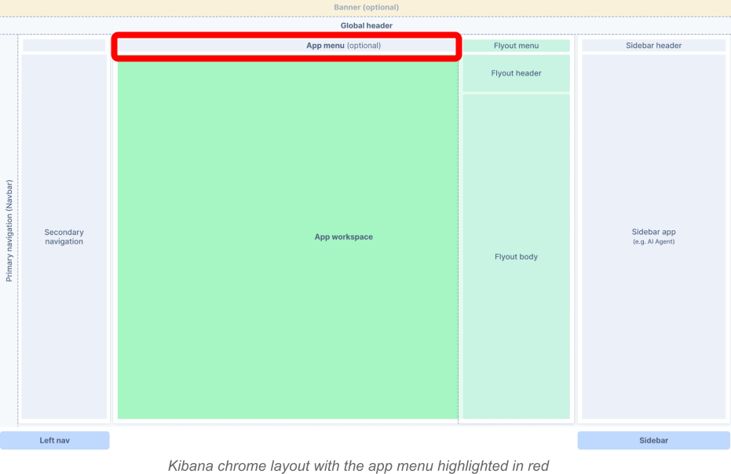

## Introduction

The app menu is an optional section of the Kibana chrome layout located beneath the global header. Each application can define its own menu to group navigation links and actions, giving users quick access to everything relevant to that application.

It offers a structured and organized way to present navigation options and actions by using a strict configuration (`AppMenuConfig`) for defining menu items. This ensures consistency across different applications and improves the overall user experience.



## Usage

There are two ways of adding the app menu to your application:
- declaratively: by rendering the `<AppMenu />` component from `@kbn/core-chrome-app-menu` package, passing the configuration and the `setAppMenu` method from the `chrome` service as props
- imperatively: by calling `setAppMenu` method from the `chrome` service.

It is also possible to use the standalone `<AppMenuComponent />` component by importing it from `@kbn/core-chrome-app-menu-components` package.

## Examples

 **Declarative (preferred)**:

```tsx
import React, { useEffect } from 'react';
import { AppMenu } from '@kbn/core-chrome-app-menu';
import type { AppMenuConfig } from '@kbn/core-chrome-app-menu-components';
import type { CoreStart } from '@kbn/core/public';

interface Props {
  config: AppMenuConfig;
  core: CoreStart;
}

const Example = ({ config, core }: Props) => {
  const { chrome } = core;

  return <AppMenu config={config} setAppMenu={chrome.setAppMenu} />;
};
```

**Imperative**:

```tsx
import React, { useEffect } from 'react';
import type { AppMenuConfig } from '@kbn/core-chrome-app-menu-components';
import type { CoreStart } from '@kbn/core/public';

interface Props {
  config: AppMenuConfig;
  core: CoreStart;
}

const Example = ({ config , core}: Props) => {
  const { chrome } = core

  useEffect(() => {
    chrome.setAppMenu(config);
  }, [chrome.setAppMenu, config]);

  return <div>Hello world!</div>;
};
```

**Standalone component**:

```tsx
import React, { useEffect } from 'react';
import { AppMenuComponent, type AppMenuConfig } from '@kbn/core-chrome-app-menu-components';

interface Props {
  config: AppMenuConfig;
}

const Example = ({ config }: Props) => {
  return <AppMenuComponent config={config} />;
};
```

## Project chrome: page header metadata

In **project** chrome (`chromeStyle === 'project'`), the application top bar renders optional fields from `AppMenuConfig` that are not part of the action strip:

- **`headerTabs`** — tabs below the page title.
- **`headerMetadata`** — a secondary row **between** the title row and `headerTabs`, when present.
- **`headerBadges`** — optional badges in the **title row**, after the title and before the global action icons (`gutterSize` `xs`).

On **EUI `xs`, `s`, and `m` viewports**, the badge row collapses to a single **`+n`** control (where `n` is the number of badges). Activating it opens a popover that lists the same badge content in a wrapping layout (panel `max-width` `min(400px, 90vw)`). From **`l`** and wider, badges stay inline in the title row as before.

`headerMetadata` is an array of `ReactNode` values. Each item is typically `EuiText` with `size="xs"`; use `<strong>` (or similar) inside the node for bold labels such as “Last updated”. Omit the field, pass an empty array, or pass only falsy entries to hide the row (it takes no vertical space).

Clear metadata when navigating away by resetting app menu config in the same `useEffect` cleanup you use for `setAppMenu` (for example `chrome.setAppMenu(undefined)` or a config without `headerMetadata`).

```tsx
import { EuiText } from '@elastic/eui';
import type { AppMenuConfig } from '@kbn/core-chrome-app-menu-components';

const config: AppMenuConfig = {
  headerMetadata: [
    <EuiText size="xs" key="updated">
      <strong>Last updated</strong> by elastic on Mar 24, 2026
    </EuiText>,
    <EuiText size="xs" key="created">
      <strong>Created</strong> by elastic on Mar 24, 2026
    </EuiText>,
  ],
};
```