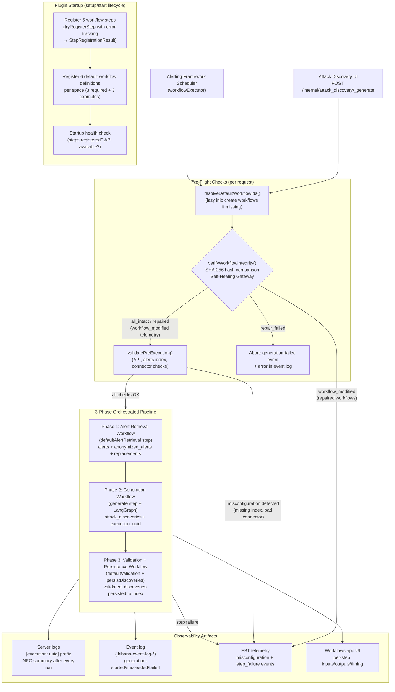

# Discoveries Plugin

Integrates Attack Discovery with the Kibana Workflows engine.

## Feature Flag

Enable in `kibana.dev.yml`:

```yaml
feature_flags.overrides:
  securitySolution.attackDiscoveryWorkflowsEnabled: true
```


## Overview

This plugin implements Attack Discovery 2.0 by decoupling alert retrieval, generation, and validation into customizable workflow steps. It provides:

- **Internal APIs** for generating and validating security insights
- **Workflow Steps** for alert retrieval, generation, and validation
- **Feature Flag** to enable/disable the functionality (`attackDiscoveryWorkflowsEnabled`)

> **Hybrid Architecture**: Scheduling is always alerting-backed regardless of the feature flag state. The Alerting Framework owns scheduling, alert persistence, and action execution (with full throttling/frequency support). The Workflows engine owns only the generation pipeline (alert retrieval → generation → validation). This unified model ensures action frequency settings are always enforced.

## Architecture

```
┌────────────────────────────────────────────────────────────────────┐
│  @kbn/discoveries Package (server-only)                            │
│  - LangGraph execution logic (graphs, orchestration)               │
│  - Event logging utilities (shared with elastic_assistant)         │
│  - Hallucination detection, anonymization, schedule transforms     │
│  - Telemetry event definitions (EBT)                               │
└────────────────────────────────────────────────────────────────────┘
┌────────────────────────────────────────────────────────────────────┐
│  @kbn/discoveries-schemas Package (shared-common)                  │
│  - OpenAPI schemas (.schema.yaml)                                  │
│  - Generated TypeScript types and Zod validators (.gen.ts)         │
└────────────────────────────────────────────────────────────────────┘
                               │
                               ▼
┌──────────────────────────────────────────────────────────────────────┐
│  discoveries Plugin                                                  │
│  ┌────────────────────────────────────────────────────────────────┐  │
│  │  Internal APIs:                                                │  │
│  │  - POST /internal/attack_discovery/_generate                   │  │
│  │  - POST /internal/attack_discovery/_validate                   │  │
│  │  - Schedule CRUD (create/find/get/update/delete/enable/disable)│  │
│  └────────────────────────────────────────────────────────────────┘  │
│  ┌────────────────────────────────────────────────────────────────┐  │
│  │  Workflow Steps:                                               │  │
│  │  - attack-discovery.defaultAlertRetrieval                      │  │
│  │  - attack-discovery.generate (with event logging)              │  │
│  │  - attack-discovery.defaultValidation                          │  │
│  │  - attack-discovery.persistDiscoveries                         │  │
│  │  - attack-discovery.run (full pipeline in one step)            │  │
│  └────────────────────────────────────────────────────────────────┘  │
└──────────────────────────────────────────────────────────────────────┘
```

### Execution Flow



## Modes of Execution

Attack Discovery can be triggered in three ways:

### 1. Ad Hoc (Interactive UI)

The user clicks **Run** in the Attack Discovery UI. The `useAttackDiscovery` hook calls `POST /internal/attack_discovery/_generate`, which fires the pipeline asynchronously and returns an `execution_uuid`. Results appear in the UI as they complete via the generations polling API.

### 2. Scheduled (Alerting Framework)

An alerting-framework rule fires on a configured cadence (e.g., every hour). The `workflowExecutor` registered with the Alerting Framework invokes the same `executeGenerationWorkflow` function as the ad-hoc path. Full throttling and frequency controls are enforced by the Alerting Framework. Schedule CRUD is exposed through the internal Schedule APIs.

### 3. The `attack-discovery.run` Step (User-Authored Workflows)

A user-authored workflow includes `attack-discovery.run` as a step. This is the composability path: the step can receive pre-retrieved alerts from upstream steps, customise retrieval mode, and return discoveries to downstream steps. The full pipeline (retrieve → generate → validate → persist) runs inside the step in either sync mode (returns discoveries inline) or async mode (returns `execution_uuid` immediately).

See [Using the `attack-discovery.run` Step](#using-the-attack-discoveryrun-step) for a full guide.

## Internal APIs

### POST /internal/attack_discovery/_generate

Kicks off the orchestrated pipeline (retrieve → generate → validate) asynchronously and returns an execution UUID for tracking. This endpoint does not accept pre-retrieved alerts and persists results via the validation step.

**Request:**
```typescript
{
  alerts_index_pattern: string,
  api_config: ApiConfig,
  filter?: Record<string, unknown>,
  start?: string,
  end?: string,
  replacements?: Replacements,
  size?: number,
  workflow_config?: {
    default_alert_retrieval_mode?: 'custom_query' | 'disabled' | 'esql',
    alert_retrieval_workflow_ids?: string[],
    validation_workflow_id?: string
  }
}
```

**Response:**
```typescript
{
  execution_uuid: string
}
```

### POST /internal/attack_discovery/_validate

Validates generated attack discoveries and persists them to the Attack Discovery index as alerts.

**Request:**
```typescript
{
  attackDiscoveries: AttackDiscovery[],
  anonymizedAlerts: Document[],
  replacements?: Replacements,
  apiConfig: ApiConfig,
  connectorName: string,
  generationUuid: string,
  alertsContextCount: number,
  enableFieldRendering?: boolean,
  withReplacements?: boolean
}
```

**Response:**
```typescript
{
  validated_discoveries: AttackDiscoveryApiAlert[]
}
```

## Workflow Steps

| Step Type ID | Purpose | Inputs (summary) | Outputs (summary) |
|---|---|---|---|
| `attack-discovery.defaultAlertRetrieval` | Retrieves and anonymizes alerts using the legacy approach | `alertsIndexPattern`, `anonymizationFields`, `apiConfig`, `filter`, `size`, `start`/`end` | `alerts`, `anonymizedAlerts`, `replacements`, `apiConfig`, `connectorName`, `alertsContextCount` |
| `attack-discovery.generate` | Generates attack discoveries from pre-retrieved alerts via LangGraph | `alerts`, `apiConfig`, `replacements`, `size` | `attack_discoveries`, `execution_uuid`, `replacements` |
| `attack-discovery.defaultValidation` | Validates discoveries with hallucination detection and deduplication | `attackDiscoveries`, `anonymizedAlerts`, `apiConfig`, `connectorName`, `generationUuid`, `alertsContextCount`, `replacements` | `validated_discoveries`, `filtered_count`, `filter_reason` |
| `attack-discovery.persistDiscoveries` | Persists validated discoveries to the Attack Discovery data store | `attackDiscoveries`, `anonymizedAlerts`, `apiConfig`, `connectorName`, `generationUuid`, `alertsContextCount`, `replacements` | `persisted_discoveries` |
| `attack-discovery.run` | Runs the full pipeline (retrieve → generate → validate → persist) as a single step | `connector_id`, `alert_retrieval_mode`, `mode` (sync/async), `alerts` (optional), `size`, `start`/`end`, `filter`, `esql_query` | `attack_discoveries`, `execution_uuid`, `alerts_context_count`, `discovery_count` |

### attack-discovery.defaultAlertRetrieval

Retrieves and anonymizes alerts using the legacy approach for backwards compatibility.

**Input:**
- `alertsIndexPattern`: Alert index pattern
- `anonymizationFields`: Fields to anonymize
- `apiConfig`: Connector configuration
- `filter`: Query filter
- `size`: Max alerts to retrieve
- `start`/`end`: Time range

**Output:**
- `alerts`: Retrieved alerts (string array)
- `anonymizedAlerts`: Document objects
- `replacements`: Anonymization map
- `apiConfig`: Passed through
- `connectorName`: Connector name
- `alertsContextCount`: Number of alerts

### attack-discovery.generate

Generates attack discoveries from pre-retrieved alerts using LangGraph execution. **Includes event logging for generation tracking.**

**Input:**
- `alerts`: Pre-retrieved alerts (string array)
- `apiConfig`: Connector configuration
- `replacements`: Anonymization map
- `size`: Max discoveries to generate

**Output:**
- `attack_discoveries`: Generated discoveries
- `execution_uuid`: Workflow execution ID (for event log tracking)
- `replacements`: Updated anonymization map

**Event Logging:**
- Emits `generation-started` event at beginning
- Emits `generation-succeeded` event on success with metrics
- Emits `generation-failed` event on error with failure reason
- Events are queryable via `GET /api/attack_discovery/generations`

### attack-discovery.defaultValidation (formerly default_promotion)

Validates ALL generated discoveries with no additional enrichment or filtering.

**Input:**
- `attackDiscoveries`: Generated discoveries
- `anonymizedAlerts`: Alert documents
- `apiConfig`: Connector configuration
- `connectorName`: Connector name
- `generationUuid`: Generation ID
- `alertsContextCount`: Alert count
- `replacements`: Anonymization map
- `enableFieldRendering`: Enable markdown syntax
- `withReplacements`: Return with replacements applied

**Output:**
- `validated_discoveries`: Validated discoveries after hallucination detection and deduplication
- `filtered_count`: Number of discoveries filtered out
- `filter_reason`: Reason discoveries were filtered (optional)

### attack-discovery.persistDiscoveries

Persists validated attack discoveries to the ad-hoc Attack Discovery data store. This step handles authentication, space resolution, and writes discoveries as alerts to the Attack Discovery index.

**Input:**
- `alerts_context_count`: Number of alerts used in generation
- `anonymized_alerts`: Anonymized alert documents
- `api_config`: Connector configuration (must include `connector_id`)
- `attack_discoveries`: Validated discoveries to persist
- `connector_name`: Connector name
- `enable_field_rendering`: Enable markdown syntax (default: `true`)
- `generation_uuid`: Generation ID for tracing
- `replacements`: Anonymization map
- `with_replacements`: Return with replacements applied (default: `false`)

**Output:**
- `persisted_discoveries`: Discoveries written to the Attack Discovery index

### attack-discovery.run

High-level entry point that orchestrates the full Attack Discovery pipeline (retrieval → generation → validation → persistence) as a single step. Supports sync mode (returns discoveries inline) and async mode (returns `execution_uuid` immediately). The `replacements` map is intentionally excluded from output.

**Input:**
- `connector_id`: Connector ID (only required field)
- `alert_retrieval_mode`: `'custom_query'` | `'disabled'` | `'esql'` | `'provided'` (default: `'custom_query'`)
- `mode`: `'sync'` | `'async'` (default: `'sync'`)
- `alerts`: Pre-retrieved alerts (string array, optional — used when `alert_retrieval_mode` is `'provided'`)
- `size`, `start`, `end`, `filter`, `esql_query`: Alert retrieval parameters
- `alert_retrieval_workflow_ids`, `validation_workflow_id`: Override default workflow IDs
- `additional_context`: Extra context passed to the LLM

**Output:**
- `attack_discoveries`: Generated discoveries (null if none found, omitted in async mode)
- `execution_uuid`: Execution UUID for event log tracking
- `alerts_context_count`: Number of alerts analyzed
- `discovery_count`: Number of discoveries generated

## Using the `attack-discovery.run` Step

The `attack-discovery.run` step is the recommended entry point for triggering Attack Discovery from a user-authored workflow. `connector_id` is the only required field — all other inputs have sensible defaults.

The **Security - Attack discovery - Run example** workflow ([`attack_discovery_run_example.workflow.yaml`](server/workflows/definitions/attack_discovery_run_example.workflow.yaml)) is a ready-made workflow that exposes all inputs and is ideal for desk-testing or as a starting template.

### Quick Start (Minimal Input)

Retrieve the 100 most recent security alerts and generate discoveries using all defaults:

```json
{
  "connector_id": "<your-connector-id>"
}
```

- `alert_retrieval_mode` defaults to `custom_query`
- `size` defaults to `100`
- `mode` defaults to `sync`
- Response includes `attack_discoveries` inline

### Retrieval Modes

#### `custom_query` — DSL query with overrides (sync)

Scope retrieval to a specific time range and alert severity:

```json
{
  "connector_id": "<your-connector-id>",
  "alert_retrieval_mode": "custom_query",
  "size": 25,
  "start": "now-72h",
  "end": "now",
  "filter": {
    "term": {
      "kibana.alert.severity": "critical"
    }
  }
}
```

#### `esql` — ES|QL query (sync)

Use an ES|QL query instead of DSL to retrieve alerts:

```json
{
  "connector_id": "<your-connector-id>",
  "alert_retrieval_mode": "esql",
  "esql_query": "FROM .alerts-security.alerts-default | WHERE kibana.alert.severity == \"critical\" | LIMIT 50"
}
```

#### ES|QL + custom retrieval workflow (sync)

Merge ES|QL results with output from a custom alert retrieval workflow (parallel execution):

```json
{
  "connector_id": "<your-connector-id>",
  "alert_retrieval_mode": "esql",
  "esql_query": "FROM .alerts-security.alerts-default | WHERE kibana.alert.severity == \"high\" | LIMIT 30",
  "alert_retrieval_workflow_ids": ["<your-retrieval-workflow-id>"]
}
```

Results from both sources are merged before generation.

#### `provided` — Pre-retrieved alerts (auto-detected)

Pass alerts directly via the `alerts` input. The step **auto-detects** that alerts are provided and sets `alert_retrieval_mode` to `provided`, skipping all retrieval:

```json
{
  "connector_id": "<your-connector-id>",
  "alerts": [
    "Alert 1: Unusual process execution on host web-prod-01. Process: cmd.exe spawned by iis.exe.",
    "Alert 2: Lateral movement detected. User admin logged in from 10.0.0.5 to 10.0.0.23 via PsExec.",
    "Alert 3: Privilege escalation attempt. User admin added to Domain Admins group."
  ]
}
```

This is the **primary composability pattern**: an upstream workflow step populates `alerts`; the `attack-discovery.run` step generates discoveries without re-querying Elasticsearch.

In a workflow YAML:

```yaml
- name: run_attack_discovery
  type: attack-discovery.run
  with:
    alerts: ${{ steps.my_retrieval_step.output.alerts }}
    connector_id: ${{ inputs.connector_id }}
```

#### `custom_only` — Custom retrieval workflows only

Skips the built-in retrieval and uses **only** results from `alert_retrieval_workflow_ids`.

### Async Mode

#### Async, all defaults

Fire the pipeline without waiting. Returns `execution_uuid` immediately; discoveries are written to Elasticsearch in the background:

```json
{
  "connector_id": "<your-connector-id>",
  "mode": "async"
}
```

- Response body contains `execution_uuid` (no `attack_discoveries` field)
- Check results via the Attack Discovery UI or `GET /api/attack_discovery/generations`

#### Async with retrieval overrides

```json
{
  "connector_id": "<your-connector-id>",
  "mode": "async",
  "alert_retrieval_mode": "custom_query",
  "size": 50,
  "start": "now-48h",
  "end": "now"
}
```

### Desk-Testing with the Example Workflow

1. Navigate to **http://localhost:5601/app/workflows**
2. Find the **Security - Attack discovery - Run example** workflow
3. Click **Test Workflow**
4. Select **Manual** as the trigger
5. Paste one of the JSON blocks above into the input editor
6. Click **Run** and observe the output

To find your connector ID:

```bash
curl -s -u elastic:changeme \
  'http://localhost:5601/api/actions/connectors' \
  | jq '.[] | {id, name}'
```

### Troubleshooting

| Problem | Solution |
|---------|----------|
| Workflow not found | Check **Workflows** → search for "Attack discovery - Run example"; restart Kibana if recently added |
| `connector_id` not found | Run the connector list `curl` command above to find available IDs |
| `provided` mode not auto-detected | Confirm `alerts` is a non-empty array of strings; explicit `alert_retrieval_mode` overrides auto-detection |
| Async results not appearing | Wait 30–60 seconds; check the Attack Discovery UI; search logs for the `execution_uuid` |

## Event Logging

The `attack-discovery.generate` workflow step emits events to the Elasticsearch event log for generation tracking. These events enable:

- **Generation Status Tracking**: Monitor workflow execution progress
- **Metrics Collection**: Track alert counts, discovery counts, and duration
- **UI Integration**: Workflow-generated discoveries appear in the Attack Discovery UI
- **API Integration**: Events are queryable via `GET /api/attack_discovery/generations`

### Event Types

1. **generation-started**: Emitted when generation begins
2. **generation-succeeded**: Emitted on successful completion with metrics
3. **generation-failed**: Emitted on error with failure reason

### Event Structure

Events follow the same structure as the public Attack Discovery API:

```typescript
{
  '@timestamp': string,
  event: {
    action: 'generation-started' | 'generation-succeeded' | 'generation-failed',
    dataset: string,  // Connector ID
    duration?: number,  // Duration in nanoseconds
    end?: string,  // ISO timestamp
    outcome?: 'success' | 'failure',
    provider: 'securitySolution.attackDiscovery',
    reason?: string,  // For failed generations
    start?: string  // ISO timestamp
  },
  kibana: {
    alert: {
      rule: {
        consumer: 'siem',
        execution: {
          metrics?: {
            alert_counts: {
              active?: number,  // Alerts sent to LLM
              new?: number  // Discoveries generated
            }
          },
          status?: string,  // Loading message
          uuid: string  // Execution UUID (ties events together)
        }
      }
    },
    space_ids: [string]
  },
  message: string,
  tags: ['securitySolution', 'attackDiscovery'],
  user: {
    name: string
  }
}
```

### Shared Event Logging Utilities

Event logging utilities are shared between `discoveries` and `elastic_assistant` plugins via the `@kbn/discoveries` package:

- `writeAttackDiscoveryEvent`: Writes events to the event log
- `getDurationNanoseconds`: Calculates duration in nanoseconds
- Event action constants: `ATTACK_DISCOVERY_EVENT_LOG_ACTION_*`

This eliminates code duplication and ensures consistent event structure across both the public API and workflow-based generation.

## Observability & Debugging

Attack Discovery produces three categories of observable artifacts. Together they let you trace any single execution end-to-end:

| Artifact | Where | Default Level | Purpose |
|----------|-------|---------------|---------|
| **Server logs** | Kibana log output | INFO | Execution summary, startup health, pre-execution validation |
| **Event log entries** | `.kibana-event-log-*` index | — | Generation tracking via `GET /api/attack_discovery/generations` |
| **Workflow execution details** | Workflows app UI | — | Per-step status, inputs/outputs, timing |
| **EBT telemetry** | Elastic analytics pipeline | — | Fleet-wide success/error/misconfiguration/step-failure metrics |

### Tracing a Single Execution with `executionUuid`

Every generation run is assigned a unique `executionUuid`. The traced logger prefixes **all** log messages for that run with `[execution: {uuid}]`, making it easy to filter logs for a single execution:

```
[2026-03-09T10:30:00.000Z][INFO ][plugins.discoveries] [execution: abc-123-def] Orchestration summary [succeeded] in 12345ms | alerts: 50, discoveries: 3
```

To filter for a specific execution:

```bash
# In Kibana server logs:
grep "execution: abc-123-def" kibana.log
```

The same `executionUuid` appears in:
- Server log messages (via the `[execution: {uuid}]` prefix)
- Event log entries (as `kibana.alert.rule.execution.uuid`)
- EBT telemetry events (as `execution_uuid` on `attack_discovery_step_failure`)
- The API response from `POST /internal/attack_discovery/_generate`

### INFO-Level Execution Summary

After every orchestration run (success or failure), a single INFO-level summary is logged. This summary mirrors the Workflow Execution Details UI and is available with default logging settings:

```
[execution: abc-123-def] Orchestration summary [succeeded] in 12345ms | alerts: 50, discoveries: 3
  retrieval: succeeded (4500ms) [default-attack-discovery-alert-retrieval] /app/workflows/default-attack-discovery-alert-retrieval?tab=executions&executionId=ret-run-id
  generation: succeeded (6000ms) [attack-discovery-generation] /app/workflows/attack-discovery-generation?tab=executions&executionId=gen-run-id
  validation: succeeded (1800ms) [attack-discovery-validate] /app/workflows/attack-discovery-validate?tab=executions&executionId=val-run-id
```

Each line includes:
- **Step status**: `succeeded`, `failed`, or `not started`
- **Duration**: Wall-clock time in milliseconds
- **Workflow ID**: The workflow definition that was executed
- **Link**: Clickable path to the Workflows app execution details page

On failure, the failed step includes the error message:

```
[execution: abc-123-def] Orchestration summary [failed] in 6500ms | alerts: 50, discoveries: 0
  retrieval: succeeded (4500ms) [default-attack-discovery-alert-retrieval] /app/workflows/...
  generation: failed (2000ms) error="Request timed out after 10m"
  validation: not started
```

### DEBUG-Level Health Checks

Before each orchestration step, a DEBUG-level health check logs the preconditions. These have **zero cost** when debug logging is off (lazy evaluation via `logger.debug(() => ...)`).

**Enable debug logging** in `kibana.dev.yml`:

```yaml
logging:
  loggers:
    - name: plugins.discoveries
      level: debug
```

**Health check format**:

```
[execution: {uuid}] Health check [{step}]: key1=value1, key2=value2
```

**Preconditions checked per step**:

| Step | Preconditions |
|------|---------------|
| **retrieval** | `alertsIndexPattern`, `anonymizationFieldCount`, `connectorId`, `customWorkflowIds`, `defaultAlertRetrievalWorkflowId`, `retrievalMode` |
| **generation** | `alertCount`, `connectorId`, `generationWorkflowId` |
| **validation** | `defaultValidationWorkflowId`, `discoveryCount`, `persist`, `validationWorkflowId` |

**Example**:

```
[execution: abc-123-def] Health check [retrieval]: alertsIndexPattern=".alerts-security.alerts-default", anonymizationFieldCount=140, connectorId="my-connector-id", customWorkflowIds=[], defaultAlertRetrievalWorkflowId="default-attack-discovery-alert-retrieval", retrievalMode="custom_query"
```

### Startup Health Check

When the plugin starts, it logs the result of a startup health check:

- **Success** (INFO): `Startup health check passed: workflow steps registered, WorkflowsManagement API available`
- **Failure** (WARN): `Startup health check found issues: {issue1}; {issue2}`

Possible issues:
- `Workflow steps were not registered`
- `WorkflowsManagement API is not available`

### Pre-Execution Validation

Before the pipeline starts, concurrent checks validate all preconditions:

| Check | Severity | Message |
|-------|----------|---------|
| WorkflowsManagement API | Critical | `WorkflowsManagement API is not available; cannot execute workflows` |
| Default workflow IDs | Critical | `Default workflows could not be resolved; cannot execute workflows` |
| Alerts index existence | Warning | `Alerts index '{pattern}' does not exist` |
| Connector accessibility | Warning | `Connector '{id}' is not accessible: {error}` |

Critical issues abort the pipeline. Warnings are logged but execution proceeds.

- **All passed** (DEBUG): `Pre-execution validation passed: all checks OK`
- **Critical issues** (WARN): `Pre-execution validation found {n} critical issue(s): {messages}`
- **Warnings** (WARN): `Pre-execution validation found {n} warning(s): {messages}`

Pre-execution misconfigurations also emit `attack_discovery_misconfiguration` EBT telemetry events (see [Telemetry README](server/lib/telemetry/README.md)).

### Self-Healing / Workflow Integrity Verification

Before the pipeline starts, the system verifies the integrity of the 3 required default workflows (alert retrieval, generation, validation). If any workflow has been deleted or modified since initial registration, it is automatically repaired. This runs between `resolveDefaultWorkflowIds()` and `validatePreExecution()` on every generation request.

**Algorithm (runs in parallel for all 3 required workflows):**

1. Fetch each workflow from Elasticsearch via the Workflows Management API
2. **If missing**: attempt re-creation from the bundled YAML definition
3. **If present**: compute SHA-256 hash of stored YAML and compare against the bundled hash
4. **If hashes match**: no action needed (`all_intact`)
5. **If hashes differ**: restore the workflow by overwriting with the bundled YAML (`repaired`)
6. **If restore fails**: record as `unrepairableError`

**Outcomes:**

| Status | Meaning | Pipeline |
|--------|---------|----------|
| `all_intact` | All 3 workflows match bundled definitions | Continues |
| `repaired` | One or more workflows were restored; `workflow_modified` telemetry emitted per repaired workflow | Continues |
| `repair_failed` | One or more workflows could not be restored | **Aborted** — `generation-failed` event written with error reason |

**Bundled YAML Hash Utility** ([`server/workflows/helpers/get_bundled_yaml_entries/`](server/workflows/helpers/get_bundled_yaml_entries/)):
- Reads the 3 required YAML files from disk at first access
- Computes SHA-256 hashes (using Node.js `crypto`) and caches results (bundled files are immutable at runtime)
- Provides both the hash (for comparison) and the YAML (for restoration)

**Error Visibility:**

| Scenario | Log Level | Telemetry |
|----------|-----------|-----------|
| All intact | DEBUG | None |
| Workflow modified, restoration succeeds | INFO | `workflow_modified` per workflow |
| Workflow missing, re-creation succeeds | ERROR (detection) + INFO (success) | `workflow_modified` per workflow |
| Repair fails | ERROR | None (execution aborted before telemetry) |

**Key implementation files:**
- Verify-and-repair logic: [`server/lib/workflow_initialization/verify_and_repair_workflows/`](server/lib/workflow_initialization/verify_and_repair_workflows/)
- Service interface + implementation: [`server/lib/workflow_initialization/`](server/lib/workflow_initialization/)
- Execution integration: [`@kbn/discoveries` `impl/attack_discovery/generation/verify_workflow_integrity/`](../../packages/kbn-discoveries/impl/attack_discovery/generation/verify_workflow_integrity/)

### UI Form Validation

The Attack Discovery settings flyout performs async runtime checks when workflow settings change:

- **Workflow existence**: Verifies selected custom alert retrieval and validation workflows exist
- **Workflow enabled**: Verifies selected workflows are enabled

Issues are displayed in the validation callout:
- **Errors** (red/danger): Configuration will definitely fail (e.g., no retrieval method selected)
- **Warnings** (yellow/warning): Configuration may have issues (e.g., workflow not found, workflow disabled)

### Troubleshooting Walkthrough

**Scenario**: A user reports that Attack Discovery shows "0 new attacks discovered."

1. **Check the execution summary** in the Kibana server log (INFO level, no config changes needed):

   ```bash
   grep "Orchestration summary" kibana.log | tail -5
   ```

   Look for the most recent execution. The summary shows which step failed and how long each step took.

2. **Follow the workflow link** from the execution summary to view detailed inputs/outputs in the Workflows app.

3. **Check for pre-execution warnings** (also INFO/WARN level):

   ```bash
   grep "Pre-execution validation" kibana.log | tail -5
   ```

   Common issues: alerts index doesn't exist, connector not accessible.

4. **Enable DEBUG logging** for deeper investigation:

   ```yaml
   logging:
     loggers:
       - name: plugins.discoveries
         level: debug
   ```

   Then reproduce the issue. Health checks before each step reveal the exact preconditions (alert count, connector ID, workflow IDs, etc.).

5. **Check EBT telemetry** for fleet-wide patterns — see the [Telemetry README](server/lib/telemetry/README.md) for `attack_discovery_misconfiguration` and `attack_discovery_step_failure` events.

## Dependencies

- `@kbn/workflows-plugin` — Workflow engine (required)
- `@kbn/discoveries` — Shared server-side business logic and event logging utilities
- `@kbn/discoveries-schemas` — OpenAPI-generated types and Zod validators for route validation
- `@kbn/attack-discovery-schedules-common` — Shared schedule infrastructure (data client, transforms, field map)
- `@kbn/actions-plugin` — Connector execution (required)
- `@kbn/alerting-plugin` — Schedule rule registration (required)
- `@kbn/event-log-plugin` — Event logging for generation tracking (required)
- `@kbn/security-plugin` — User authentication (required)
- `@kbn/spaces-plugin` — Space ID resolution (optional)
- `@kbn/elastic-assistant-plugin` — Optional executor registration for scheduled workflow execution

## Testing

See:

- `TESTING_INSTRUCTIONS.md`
- `WORKFLOW_TESTING_RESULTS.md`

## Architecture Decisions

This section documents the key design decisions behind the Attack Discovery 2.0 workflow integration. It targets a workflows-expert tech lead reviewing the PR and explains the _why_ behind each choice.

### Why Workflows

Attack Discovery 1.0 was a monolithic endpoint: one HTTP handler retrieved alerts, invoked the LLM, validated results, and persisted discoveries — all inline. This made the pipeline opaque to operators and impossible to customize without forking the plugin.

Workflows unlock four capabilities that the monolithic approach cannot provide:

1. **Observability**: Each pipeline phase (retrieval, generation, validation) executes as a distinct workflow run. The Workflows app shows per-step status, inputs, outputs, and timing — no `DEBUG` logging required.
2. **Customizability**: Users replace any phase by pointing at a different workflow ID. A team can swap the default DSL-based retrieval for an ES|QL query (see `attack_discovery_esql_example.workflow.yaml`) without modifying plugin code.
3. **Composability**: Workflow steps are reusable building blocks. The `attack-discovery.generate` step can appear in a user-authored workflow alongside custom pre-processing or post-processing steps, with data threaded via Liquid expressions.
4. **Scheduling**: The same steps power both the interactive `_generate` endpoint and the alerting-framework-based scheduler (`workflowExecutor`), eliminating separate code paths for on-demand vs. scheduled generation.

### Step Registration Strategy: Two-Tier Model

Steps are organized into two tiers based on their intended audience:

| Tier | Audience | Steps | Registration |
|------|----------|-------|-------------|
| **User-facing** | Workflow authors (via YAML) | `defaultAlertRetrieval`, `generate`, `defaultValidation`, `persistDiscoveries`, `run` | Registered in `plugin.setup()`, visible in step catalog |
| **Internal** | Plugin code only | Pipeline orchestration, event logging, pre-execution validation, integrity verification | Not registered as steps; implemented as helper functions |

**Why two tiers?** Registered steps carry a public contract: their input/output schemas become the API surface that user-authored workflows depend on. Anything that does not need to be referenced from YAML stays as an internal helper to avoid inflating the catalog with implementation details.

Each registered step has a **common definition** (`common/step_types/*.ts`) containing the `id`, `inputSchema`, `outputSchema`, `label`, `description`, and `category`. This definition is shared between server-side handler registration and the step catalog UI. The server-side handler (`server/workflows/steps/*/get_*_step_definition.ts`) wraps the common definition with `createServerStepDefinition` and provides the actual implementation.

### Ergonomics Design

#### Why a `run` Step

The four existing steps each handle one phase of the pipeline. To generate discoveries, a workflow author currently must compose all four steps and thread intermediate data between them via Liquid expressions — a non-trivial amount of boilerplate:

```yaml
steps:
  - name: retrieve
    type: attack-discovery.defaultAlertRetrieval
    with:
      alerts_index_pattern: ${{ inputs.alerts_index_pattern }}
      anonymization_fields: ${{ inputs.anonymization_fields }}
      api_config: ${{ inputs.api_config }}
      # ... 6 more fields
  - name: generate
    type: attack-discovery.generate
    with:
      alerts: ${{ steps.retrieve.output.alerts }}
      api_config: ${{ steps.retrieve.output.api_config }}
      replacements: ${{ steps.retrieve.output.replacements }}
      # ...
  - name: validate
    type: attack-discovery.defaultValidation
    with:
      attack_discoveries: ${{ steps.generate.output.attack_discoveries }}
      anonymized_alerts: ${{ steps.retrieve.output.anonymized_alerts }}
      # ... 7 more fields threaded from prior steps
  - name: persist
    type: attack-discovery.persistDiscoveries
    with:
      # ... similarly verbose
```

The `attack-discovery.run` step collapses this into a single step that runs the full pipeline internally:

```yaml
steps:
  - name: discover
    type: attack-discovery.run
    with:
      connector_id: ${{ inputs.connector_id }}
```

This dramatically reduces the surface area a workflow author must understand. Advanced users who need to inject custom logic between phases can still compose the individual steps directly.

#### `api_config` Simplification

The `run` step takes a `connector_id` directly (not a full `api_config` object). Every connector already knows its own action type, so requiring the caller to provide both `action_type_id` and `connector_id` is redundant and error-prone. The step resolves the action type from the connector at runtime.

#### Why `run` Does Not Use `workflow.execute` Composition

An alternative design would have the `run` step call `workflow.execute` internally to invoke the existing generation workflow. This was rejected for three reasons:

1. **Timeout nesting**: A step executing a workflow creates a nested timeout boundary. The outer step timeout must be strictly greater than the inner workflow timeout, which is fragile and hard for users to reason about.
2. **Observability gap**: The inner workflow execution would appear as a single opaque step in the parent workflow's execution details, losing the per-phase visibility that workflows provide.
3. **Error propagation**: Failures in the inner workflow must be unwrapped and re-thrown with meaningful context, adding complexity without benefit over direct function composition.

### Sync/Async Mode Design

The `run` step supports two modes:

| Mode | Behavior | Use Case |
|------|----------|----------|
| **async** (default) | Returns `{ execution_uuid }` immediately; discoveries arrive via event log | Interactive UI, scheduled generation |
| **sync** | Blocks until pipeline completes; returns `{ attack_discoveries }` | Agent Builder tools, automation scripts |

**Why two modes?** The existing `_generate` endpoint is async because LLM generation can take minutes and HTTP requests should not block that long. However, Agent Builder tools and workflow steps that compose AD need the result inline — they cannot poll the event log. Sync mode serves this use case.

The mode is selected via a `mode` enum input (`'sync'` or `'async'`), not via separate step type IDs, because the underlying pipeline logic is identical — only the response envelope differs.

### Why `_generate` Stays Async

The `POST /internal/attack_discovery/_generate` endpoint remains async (returns `execution_uuid`, not discoveries) for five structural reasons:

1. **HTTP timeout budget**: Generation routinely takes 2–5 minutes. Kibana's default idle socket timeout is 2 minutes. Extending it to 10 minutes risks proxy/load-balancer timeouts in production.
2. **UI responsiveness**: The Attack Discovery UI shows a loading state with progress messages immediately after the request returns. If `_generate` blocked, the UI would appear frozen with no feedback.
3. **Event log contract**: The UI polls `GET /api/attack_discovery/generations` for status. This event-log-based contract allows multiple browser tabs and the scheduler to observe the same execution, which a synchronous response cannot support.
4. **Retry safety**: If the browser disconnects during a long-running sync request, the generation is lost. With async, the pipeline runs server-side to completion regardless of client state.
5. **Scheduling parity**: The alerting-framework scheduler (`workflowExecutor`) invokes the same `executeGenerationWorkflow` function. Making `_generate` async keeps the same code path for both triggers; a sync variant would need a separate code path.

### Timeout Architecture

Generation spans three workflow executions (retrieval, generation, validation), each with its own timeout. The timeout architecture uses a layered model with a 10-minute total budget:

```mermaid
gantt
    title Attack Discovery Timeout Budget (10 min total)
    dateFormat X
    axisFormat %M:%S

    section HTTP Layer
    Route handler idle socket   :a1, 0, 600

    section Workflow Layer
    Alert retrieval (5 min max)  :a2, 0, 300
    Generation (10 min max)      :a3, 300, 600
    Validation (2 min max)       :a4, 600, 720

    section LLM Layer
    Connector timeout per call   :a5, 300, 540
```



| Layer | Timeout | Controls |
|-------|---------|----------|
| **HTTP route handler** | 10 min (`DEFAULT_ROUTE_HANDLER_TIMEOUT_MS`) | Kibana idle socket timeout; prevents the connection from being reaped during long runs |
| **Workflow step** | Per-step (`timeout` field in YAML) | Retrieval: 5 min, Generation: 10 min. If a step exceeds its timeout, the workflow engine cancels it |
| **Connector (LLM call)** | `connectorTimeout` (passed to step) | Individual LLM API call timeout. Multiple calls may occur within a single generation (e.g., LangGraph retries) |
| **Polling** | Intervals set by orchestrator | The pipeline orchestrator polls workflow completion status; polling intervals should be shorter than step timeouts |

**Design principle**: Each layer's timeout should be strictly less than or equal to the layer above it. The HTTP route handler timeout is the outermost boundary; individual LLM calls are the innermost. This ensures that timeouts propagate from the inside out: a slow LLM call triggers a connector timeout, which triggers a step failure, which the orchestrator catches and reports — rather than the HTTP connection silently closing.

### Security Considerations

#### Strict `string[]` Alert Contract

The `attack-discovery.generate` step accepts alerts as `string[]` — not as structured alert objects. This is a deliberate security boundary:

1. **Anonymization enforcement**: By the time alerts reach the generation step, they have already been transformed by the retrieval step into anonymized string representations. The string type makes it impossible to accidentally pass raw alert objects containing PII to the LLM.
2. **Schema simplicity**: A `string[]` schema cannot carry nested fields that might leak sensitive data. The contract is unambiguous: each element is a single anonymized text representation of an alert.
3. **Liquid expression safety**: In user-authored workflows, Liquid expressions can pass `string[]` values between steps. If the contract were a complex object type, Liquid filters could inadvertently expose nested sensitive fields.

#### Anonymization Boundary

The anonymization boundary sits at the **alert retrieval** step:

```
Raw alerts (Elasticsearch) → [anonymization boundary] → Anonymized strings → LLM → Discoveries
```

Everything upstream of the retrieval step output operates on raw data. Everything downstream operates on anonymized data. The `replacements` map (mapping anonymized tokens back to real values) is the only bridge between the two worlds.

The `defaultAlertRetrieval` step also ensures the `_id` field is always present in the anonymization configuration (via `ensureRequiredAnonymizationFields`). This is required because downstream steps use real alert IDs for hallucination detection — IDs are allowed but not anonymized.

#### Liquid Filter Pattern

User-authored workflows use Liquid expressions to thread data between steps. The Liquid template engine runs in a sandboxed environment where:

- Only step outputs and workflow inputs are accessible (no access to server internals)
- Built-in Liquid filters (e.g., `| sort: "title"`, `| size`) operate on the data without side effects
- No custom Liquid tags or filters are registered that could access the filesystem, network, or Kibana internals

The custom validation example (`attack_discovery_custom_validation_example.workflow.yaml`) demonstrates this pattern: it uses `| sort: "title"` between the validation and persist steps to reorder discoveries — a transformation that requires no custom step code.

### Replacements Map Security Boundary

The `replacements` map (`Record<string, string>`) maps anonymized tokens (e.g., `"SRVHQMWPN001"`) back to real values (e.g., `"dc01.example.com"`). This map is sensitive because it is the key to de-anonymizing all LLM-visible data.

**Where the replacements map flows:**

| Step | Receives | Returns |
|------|----------|---------|
| `defaultAlertRetrieval` | Optional initial replacements | Updated replacements (new tokens from anonymization) |
| `generate` | Replacements from retrieval | Updated replacements (LLM may create new mappings) |
| `defaultValidation` | Replacements from generation | Not in output (consumed internally for hallucination check) |
| `persistDiscoveries` | Replacements from generation | Not in output (consumed internally for de-anonymized persistence) |
| `run` | Optional initial replacements | **Excluded from output** (security boundary) |

**Key invariant**: The `run` step deliberately excludes the replacements map from its output. A workflow that invokes `run` receives discoveries but cannot access the de-anonymization key. This prevents user-authored workflows from inadvertently logging or forwarding the replacements to external systems.

### Agent Builder Interaction Model

Attack Discovery steps can be invoked from Agent Builder tools. The interaction matrix shows which combinations are supported:

| Agent Builder Pattern | Steps Used | Mode | Returns |
|-----------------------|------------|------|---------|
| **Full pipeline** | `run` | sync | `attack_discoveries`, `execution_uuid`, `discovery_count` |
| **Custom retrieval + generation** | `defaultAlertRetrieval` → `generate` | sync | `attack_discoveries`, `replacements` |
| **Generation only** (pre-retrieved alerts) | `generate` | sync | `attack_discoveries`, `execution_uuid`, `replacements` |
| **Validation only** | `defaultValidation` | sync | `validated_discoveries`, `filtered_count` |

**Recommended pattern**: Use the `run` step in sync mode. It handles the full pipeline internally, returns only the discoveries (no sensitive replacements map), and presents a minimal input surface (`connector_id` is the only required field when defaults are acceptable).

**Why sync mode for Agent Builder?** Agent Builder tools execute as part of a larger agent conversation. The agent needs the result inline to formulate its response. Async mode would require the agent to poll for results, which is not supported in the current Agent Builder execution model.

The `_generate_workflow` endpoint demonstrates an existing Agent Builder integration: it uses the `alertRetrievalBuilderSkill` to generate custom alert retrieval workflows via an LLM agent. This endpoint composes Agent Builder's `runAgent` with the Workflows Management API, showing how the two systems interact.

