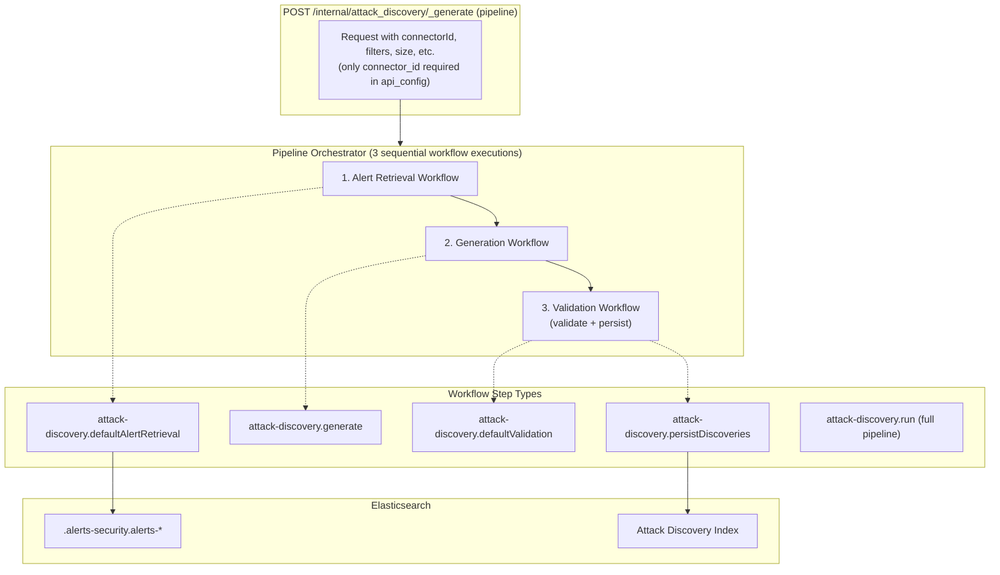

# Attack Discovery Workflow Definitions

This document describes the out-of-the-box Attack Discovery workflows and their purposes.

## Overview

The Attack Discovery workflow architecture decouples alert retrieval, generation, and validation into modular, reusable components. The pipeline endpoint (`POST /internal/attack_discovery/_generate`) kicks off the generation workflow asynchronously, returns an execution UUID, and persists discoveries via the validation step.

### Architecture



### Data Flow

1. **Request**: The pipeline endpoint receives parameters (connector config with only `connector_id` required, filters, time range, etc.) and returns an execution UUID immediately
2. **Alert Retrieval**: Queries Elasticsearch for alerts matching the criteria and anonymizes sensitive fields
3. **Generation**: Sends anonymized alerts to the LLM for attack pattern analysis
4. **Validation**: Stores generated discoveries in the Attack Discovery index for the Security UI

> **Self-Healing**: The 3 required default workflows (`default-attack-discovery-alert-retrieval`, `attack-discovery-generation`, `attack-discovery-validate`) are protected by an integrity verification system that detects and automatically repairs deletions or modifications before each generation run. See the [Self-Healing section](../../../README.md#self-healing--workflow-integrity-verification) in the plugin README.

## Workflow Definitions

### 1. Default Alert Retrieval (`default-attack-discovery-alert-retrieval`)

**File**: `default_attack_discovery_alert_retrieval.workflow.yaml`

**Purpose**: Retrieves and anonymizes alerts from Elasticsearch using built-in logic. This is the LEGACY alert retrieval mechanism used by the `_generate` endpoint. For custom alert retrieval, create your own workflow.

**When to Use**:
- Default alert retrieval for production use cases
- When you need standard anonymization of sensitive fields
- As the data source for generation workflows

#### Inputs

| Name | Type | Required | Default | Description |
|------|------|----------|---------|-------------|
| `alertsIndexPattern` | string | ✅ | - | Alert index pattern to search (e.g., `.alerts-security.alerts-default`) |
| `anonymizationFields` | array | ✅ | - | Fields to anonymize (see anonymization config below) |
| `apiConfig` | string | ✅ | - | LLM API configuration (JSON string). Only `connector_id` is required; `action_type_id` is resolved at runtime when omitted |
| `filter` | string | ❌ | - | Query filter for alerts (JSON string) |
| `size` | number | ❌ | `150` | Maximum alerts to retrieve |
| `start` | string | ❌ | - | Time range start (e.g., `now-24h`) |
| `end` | string | ❌ | - | Time range end (e.g., `now`) |

#### Outputs

| Name | Type | Description |
|------|------|-------------|
| `alerts` | string[] | Retrieved alerts as anonymized strings (for LLM consumption) |
| `anonymized_alerts` | Document[] | Anonymized alert documents (for validation) |
| `replacements` | Record<string, string> | Anonymization replacements map |
| `api_config` | ApiConfig | LLM API configuration (passed through) |
| `connector_name` | string | LLM connector name (resolved from connector_id when not provided in input) |
| `alerts_context_count` | number | Number of alerts retrieved |

---

### 2. ES|QL Example (`attack-discovery-esql-example`)

**File**: `attack_discovery_esql_example.workflow.yaml`

**Purpose**: Demonstrates custom alert retrieval using ES|QL queries via the `elasticsearch.esql.query` step type. This workflow serves as a reference implementation for teams who want to customize how alerts are retrieved.

The ES|QL query replicates the behavior of the DSL query in `kbn-elastic-assistant-common/impl/alerts/get_open_and_acknowledged_alerts_query`:
- Retrieves alerts with `workflow_status` IN ('open', 'acknowledged')
- Excludes building block alerts (`building_block_type` IS NULL)
- Sorts by `risk_score` (descending), then `@timestamp` (descending)
- Applies configurable time range filter using Elasticsearch DSL date math

**When to Use**:
- Reference implementation for building custom retrieval workflows
- When you need custom ES|QL-based alert queries
- For advanced filtering and transformation scenarios

#### Inputs

| Name | Type | Required | Default | Description |
|------|------|----------|---------|-------------|
| `alerts_index_pattern` | string | ✅ | - | Alert index pattern (e.g., `.alerts-security.alerts-default`) |
| `size` | number | ❌ | `100` | Maximum alerts to retrieve (1-10000) |
| `start` | string | ❌ | `now-24h` | Time range start (date math) |
| `end` | string | ❌ | `now` | Time range end (date math) |

#### Outputs

The `elasticsearch.esql.query` step returns ES|QL query results in the standard format:
- `columns`: Array of column metadata (name, type)
- `values`: Array of row arrays containing the query results

**Note**: Unlike the legacy retrieval workflow, this ES|QL example returns raw query results without anonymization. Users should add post-processing steps if anonymization is required.

---

### 3. Generation (`attack-discovery-generation`)

**File**: `attack_discovery_generation.workflow.yaml`

**Purpose**: Generates Attack discoveries from the provided context. This workflow is for Generation only; no Alert retrieval or validation steps are executed. The `_generate` endpoint orchestrates alert retrieval, generation, and validation as separate workflow executions.

**When to Use**:
- Invoked by the `_generate` endpoint's manual orchestrator (not typically called directly)
- When you need only the generation step with pre-retrieved alerts

#### Inputs

| Name | Type | Required | Default | Description |
|------|------|----------|---------|-------------|
| `additional_alerts` | string[] | ❌ | `[]` | Pre-retrieved alerts passed from the pipeline endpoint |
| `api_config` | object | ✅ | - | LLM connector configuration. Only `connector_id` is required; `action_type_id` is resolved at runtime when omitted |
| `replacements` | object | ❌ | - | Initial anonymization replacements |

#### Outputs

| Name | Type | Description |
|------|------|-------------|
| `alerts_context_count` | number | Number of alerts analyzed |
| `attack_discoveries` | array | Generated attack discoveries |
| `execution_uuid` | string | Generation execution UUID for tracking |
| `replacements` | string | Updated anonymization replacements |

---

### 4. Default Validation (`attack-discovery-validate`)

**File**: `attack_discovery_validate.workflow.yaml`

**Purpose**: Validates generated discoveries and persists them to the Attack Discovery Elasticsearch index. This makes the discoveries visible in the Security UI.

**When to Use**:
- Default validation for storing discoveries
- As the final step in the generation pipeline
- When you want discoveries visible in the Attack Discovery UI

#### Inputs

| Name | Type | Required | Default | Description |
|------|------|----------|---------|-------------|
| `attackDiscoveries` | array | ✅ | - | Attack discoveries to validate |
| `anonymizedAlerts` | array | ✅ | - | Anonymized alerts in Document format |
| `apiConfig` | string | ✅ | - | LLM API configuration (JSON string). Only `connector_id` is required; `action_type_id` is resolved at runtime when omitted |
| `connectorName` | string | ❌ | - | LLM connector name (resolved from connector_id when omitted) |
| `generationUuid` | string | ✅ | - | Generation execution UUID for tracking |
| `alertsContextCount` | number | ✅ | - | Number of alerts analyzed |
| `replacements` | string | ❌ | - | Anonymization replacements (JSON string) |
| `enableFieldRendering` | boolean | ❌ | `true` | Enable field rendering in UI |
| `withReplacements` | boolean | ❌ | `false` | Include replacements in response |

#### Outputs

| Name | Type | Description |
|------|------|-------------|
| `validated_discoveries` | AttackDiscoveryApiAlert[] | Validated discoveries as alerts |

---

## Data Contracts

### TypeScript Types

The workflow inputs and outputs are defined in the `@kbn/discoveries` package:

```typescript
// API Configuration
interface ApiConfig {
  action_type_id?: string; // Optional — resolved from connector_id at runtime
  connector_id: string;    // Connector UUID (only required field)
  model?: string;          // Optional model name
}

// Anonymization Field Configuration
interface AnonymizationField {
  id: string;              // Unique field identifier
  field: string;           // Field path (e.g., 'host.name')
  allowed: boolean;        // Whether field is allowed in output
  anonymized: boolean;     // Whether to anonymize this field
}

// Attack Discovery Output
interface AttackDiscovery {
  id: string;
  title: string;
  alertIds: string[];
  timestamp: string;
  detailsMarkdown: string;
  summaryMarkdown: string;
  entitySummaryMarkdown?: string;
  mitreAttackTactics?: string[];
}

// Replacements Map
type Replacements = Record<string, string>;
// Example: { "SRVHQMWPN001": "dc01.example.com" }
```

### Workflow Step Data Flow

```
┌──────────────────────┐
│   Alert Retrieval    │
│                      │
│  Input:              │
│  - alertsIndexPattern│
│  - anonymizationFields│
│  - apiConfig (only   │
│    connector_id req) │
│  - filter, size, etc.│
│                      │
│  Output:             │
│  - alerts (string[]) │
│  - anonymized_alerts │
│  - replacements      │
│  - api_config        │
│  - connector_name    │
│  - alerts_context_count│
└──────────┬───────────┘
           │
           ▼
┌──────────────────────┐
│     Generation       │
│                      │
│  Input:              │
│  - alerts            │◄── from retrieve_alerts.output.alerts
│  - api_config        │◄── from retrieve_alerts.output.api_config
│  - replacements      │◄── from retrieve_alerts.output.replacements
│  - type, size        │
│                      │
│  Output:             │
│  - attack_discoveries│
│  - execution_uuid    │
│  - replacements      │
└──────────┬───────────┘
           │
           ▼
┌──────────────────────┐
│     Validation       │
│                      │
│  Input:              │
│  - attack_discoveries│◄── from generate.output.attack_discoveries
│  - anonymized_alerts │◄── from retrieve_alerts.output.anonymized_alerts
│  - api_config        │◄── from retrieve_alerts.output.api_config
│  - connector_name    │◄── from retrieve_alerts.output.connector_name (optional)
│  - generation_uuid   │◄── from generate.output.execution_uuid
│  - alerts_context_count│◄── from retrieve_alerts.output.alerts_context_count
│  - replacements      │◄── from generate.output.replacements
│                      │
│  Output:             │
│  - validated_discoveries│
└──────────────────────┘
```

---

## Workflow IDs

The following well-known workflow IDs are defined in `@kbn/discoveries/impl/attack_discovery/constants`:

| Constant | Workflow ID | Description |
|----------|-------------|-------------|
| `ATTACK_DISCOVERY_DEFAULT_VALIDATION_WORKFLOW_ID` | `attack-discovery-validate` | Default validation workflow |
| `ATTACK_DISCOVERY_ESQL_EXAMPLE_WORKFLOW_ID` | `attack-discovery-esql-example` | ES|QL example workflow |
| `ATTACK_DISCOVERY_DEFAULT_ALERT_RETRIEVAL_WORKFLOW_ID` | `default-attack-discovery-alert-retrieval` | Default alert retrieval |
| `ATTACK_DISCOVERY_CUSTOM_VALIDATION_EXAMPLE_WORKFLOW_ID` | `attack-discovery-custom-validation-example` | Custom validation example (validate → sort → persist) |
| `ATTACK_DISCOVERY_GENERATION_WORKFLOW_ID` | `attack-discovery-generation` | Generation workflow |
| `ATTACK_DISCOVERY_RUN_EXAMPLE_WORKFLOW_ID` | `attack-discovery-run-example` | Run example (full pipeline via `attack-discovery.run` step) |

---

## Liquid Filter Patterns

User-authored workflows use [Liquid](https://shopify.github.io/liquid/) expressions to thread data between steps. Several patterns are especially relevant for Attack Discovery workflows.

### The `| json` Filter (Alert Format Conversion)

The `attack-discovery.generate` step accepts alerts as `string[]` — each element is an anonymized text representation of an alert. When composing workflows that retrieve alerts from a different source (e.g., an ES|QL query step), the raw output may be structured data (objects, arrays of arrays, etc.). The `| json` Liquid filter converts structured data to a JSON string, enabling format conversion between steps with incompatible types.

**Example**: Converting ES|QL query output to a JSON string for downstream processing:

```yaml
steps:
  - name: query_alerts
    type: elasticsearch.esql.query
    with:
      query: "FROM .alerts-security.alerts-default | LIMIT 10"

  - name: format_alerts
    type: transform
    with:
      data: '${{ steps.query_alerts.output.values | json }}'
```

The `| json` filter serializes the value to a JSON string. This is the inverse of the `| parse_json` filter (where available). Use it when a downstream step expects a string representation of structured data.

### The `| sort` Filter (Reordering Step Outputs)

The sorted validation example workflow demonstrates using `| sort: "title"` to reorder discoveries alphabetically between the validation and persist steps:

```yaml
attack_discoveries: '${{ steps.validate_discoveries.output.validated_discoveries | sort: "title" }}'
```

This pattern allows trivial data transformations between steps without requiring a custom step type. See `attack_discovery_custom_validation_example.workflow.yaml` for the complete example.

### The `| size` Filter (Counting Elements)

The generation workflow uses `| size` to count the number of alerts passed as input:

```yaml
outputs:
  - name: alerts_context_count
    value: ${{ inputs.additional_alerts | size }}
```

---

## Debugging with Execution Tracing

Every generation run is assigned a unique `executionUuid`. The traced logger prefixes **all** log messages for that run with `[execution: {uuid}]`, allowing you to filter logs for a single execution across all three pipeline steps.

### Execution Trace ID Pattern

All server log messages from a generation run share the same trace prefix:

```
[plugins.discoveries] [execution: abc-123-def] Health check [retrieval]: ...
[plugins.discoveries] [execution: abc-123-def] Health check [generation]: ...
[plugins.discoveries] [execution: abc-123-def] Orchestration summary [succeeded] in 12345ms | ...
```

Filter for a specific execution:

```bash
grep "execution: abc-123-def" kibana.log
```

The same `executionUuid` links log messages to event log entries (`kibana.alert.rule.execution.uuid`) and the API response from `POST /internal/attack_discovery/_generate`.

### INFO-Level Execution Summary (Default Logging)

After every orchestration run, a single INFO-level summary is logged automatically (no config changes needed):

```
[execution: abc-123-def] Orchestration summary [succeeded] in 12345ms | alerts: 50, discoveries: 3
  retrieval: succeeded (4500ms) [default-attack-discovery-alert-retrieval] /app/workflows/default-attack-discovery-alert-retrieval?tab=executions&executionId=ret-run-id
  generation: succeeded (6000ms) [attack-discovery-generation] /app/workflows/attack-discovery-generation?tab=executions&executionId=gen-run-id
  validation: succeeded (1800ms) [attack-discovery-validate] /app/workflows/attack-discovery-validate?tab=executions&executionId=val-run-id
```

On failure, the summary shows which step failed:

```
[execution: abc-123-def] Orchestration summary [failed] in 6500ms | alerts: 50, discoveries: 0
  retrieval: succeeded (4500ms) [default-attack-discovery-alert-retrieval] /app/workflows/...
  generation: failed (2000ms) error="Request timed out after 10m"
  validation: not started
```

### DEBUG-Level Health Checks

Before each orchestration step, a DEBUG-level health check logs the preconditions. These use lazy evaluation (`logger.debug(() => ...)`) so they have zero cost when debug logging is off.

**Enable debug logging** in `kibana.dev.yml`:

```yaml
logging:
  loggers:
    - name: plugins.discoveries
      level: debug
```

**Health check format**:

```
[execution: {uuid}] Health check [{step}]: key1=value1, key2=value2
```

**Preconditions verified per step**:

| Step | Preconditions | What to look for |
|------|---------------|------------------|
| **retrieval** | `alertsIndexPattern`, `anonymizationFieldCount`, `connectorId`, `customWorkflowIds`, `defaultAlertRetrievalWorkflowId`, `retrievalMode` | `anonymizationFieldCount=0` means no anonymization fields configured; `retrievalMode` should match your intent |
| **generation** | `alertCount`, `connectorId`, `generationWorkflowId` | `alertCount=0` means no alerts were retrieved — check time range and filters |
| **validation** | `defaultValidationWorkflowId`, `discoveryCount`, `persist`, `validationWorkflowId` | `discoveryCount=0` means the LLM found no attack patterns in the alerts |

**Example** (retrieval step):

```
[execution: abc-123-def] Health check [retrieval]: alertsIndexPattern=".alerts-security.alerts-default", anonymizationFieldCount=140, connectorId="my-connector-id", customWorkflowIds=[], defaultAlertRetrievalWorkflowId="default-attack-discovery-alert-retrieval", retrievalMode="custom_query"
```

### Troubleshooting Common Issues

| Symptom | Where to look | Resolution |
|---------|---------------|------------|
| "0 new attacks discovered" | Execution summary — check if retrieval step returned `alerts: 0` | Verify alert time range, index pattern, and filters |
| Pipeline never starts | Pre-execution validation warnings (WARN level) | Check connector accessibility and alerts index existence |
| Startup warnings | Startup health check (INFO/WARN level) | Ensure workflow steps registered and WorkflowsManagement API is available |
| Specific step failure | Execution summary — step line shows `failed` with error message | Follow the workflow link to see detailed inputs/outputs |
| Fleet-wide patterns | EBT telemetry events | See [Telemetry README](../../lib/telemetry/README.md) for `attack_discovery_misconfiguration` and `attack_discovery_step_failure` |

### Execution Flow Path

The `_generate` endpoint executes via the **Generation Workflow Path**, which requires the `workflowsManagementApi` to be available. The orchestrator (`run_manual_orchestration`) sequences the three sub-workflows (alert retrieval, generation, validation) using real Kibana Workflow executions. Each step runs as a separate workflow execution, and all are linked by the shared `executionUuid` in log messages.

---

## See Also

- [README.md](../../../README.md) - Plugin overview and API documentation
- [GENERATE_REQUEST_PROPERTY_TRACING.md](../../../docs/GENERATE_REQUEST_PROPERTY_TRACING.md) - Request property flow documentation
